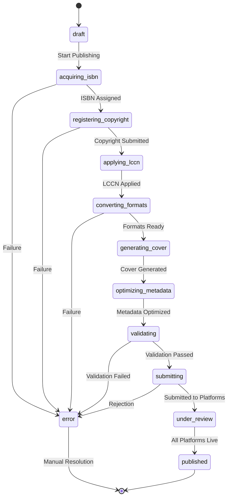
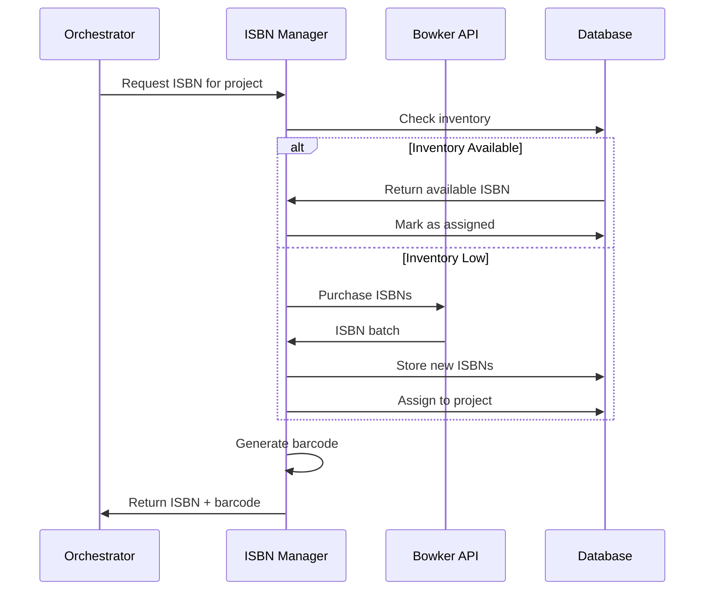
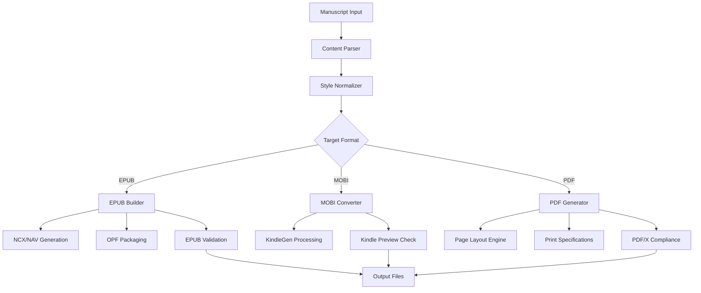
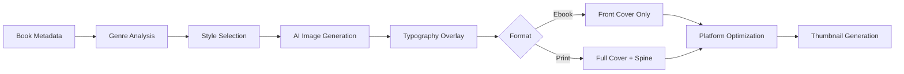
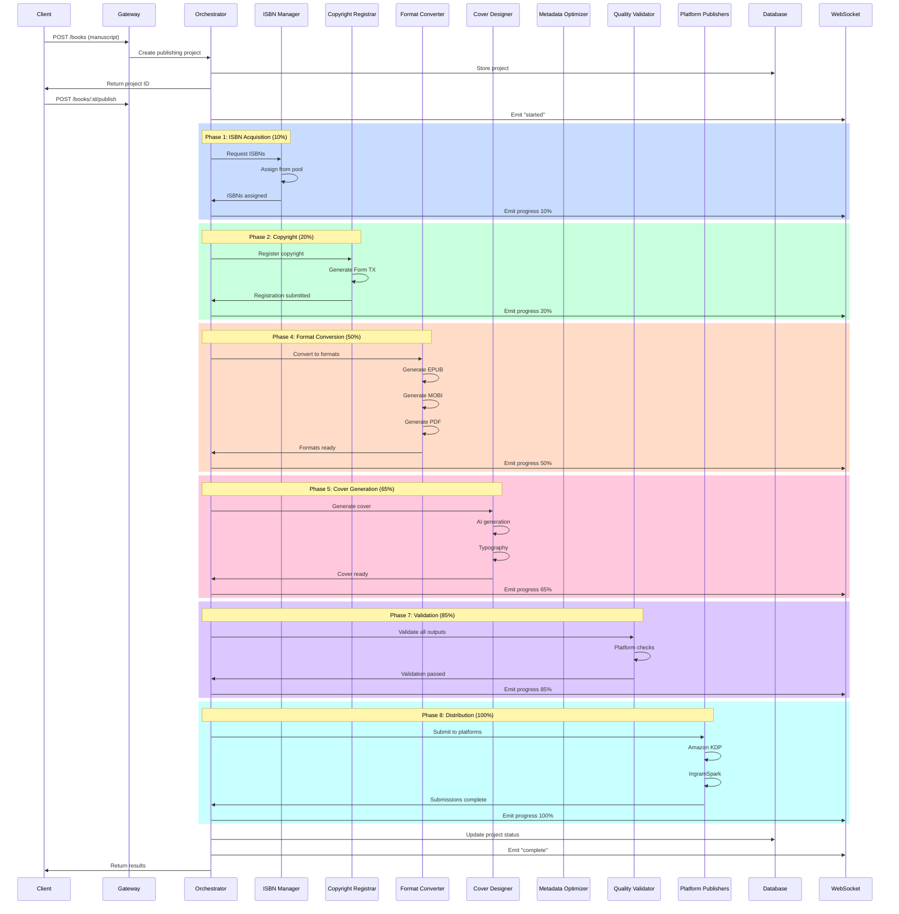
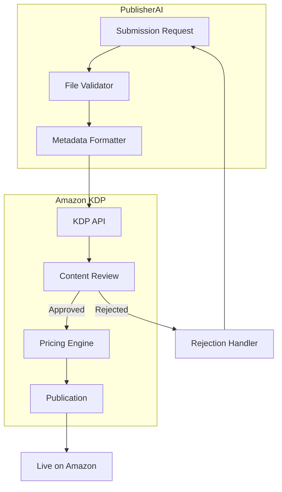
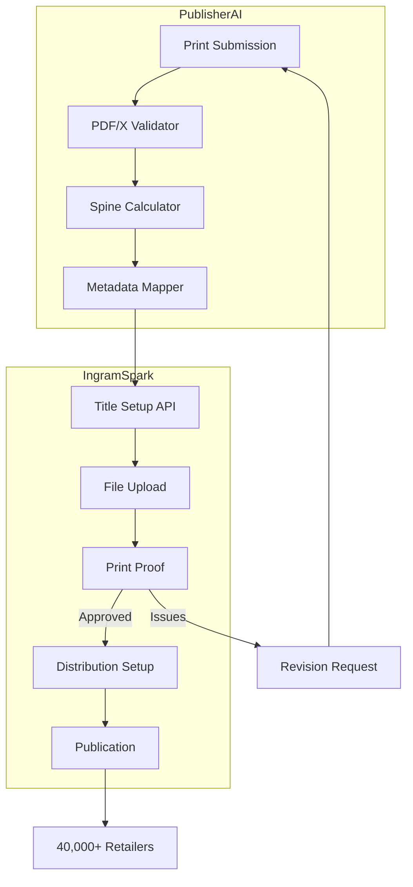
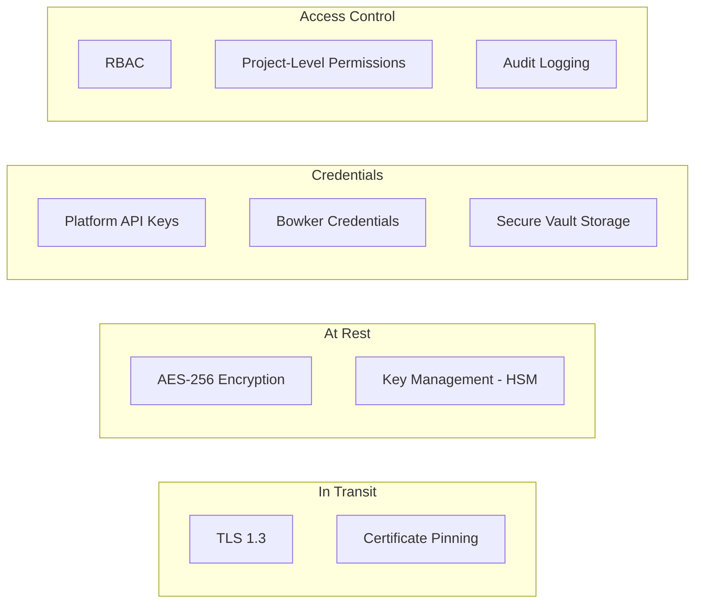
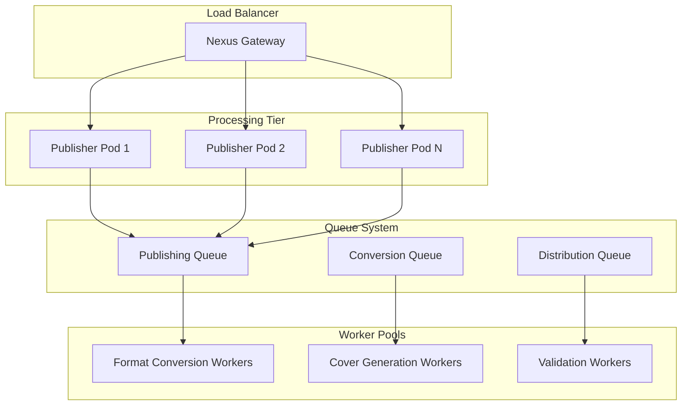

# Architecture Guide - PublisherAI

Technical architecture and system design for PublisherAI - Book Publishing and Distribution Platform.

---

## System Overview

PublisherAI is built on a modular, event-driven architecture designed to orchestrate the complete book publishing lifecycle. The system coordinates ISBN acquisition, copyright registration, format conversion, quality validation, and multi-platform distribution through an eight-phase pipeline with real-time progress tracking.

```mermaid
graph TB
    subgraph "Client Layer"
        A[Web Dashboard]
        B[REST API]
        C[SDK Clients]
        D[Webhook Consumers]
    end

    subgraph "API Gateway"
        E[Nexus Gateway]
        E --> F[Authentication]
        E --> G[Rate Limiting]
        E --> H[Request Routing]
    end

    subgraph "PublisherAI Plugin Container"
        I[Publishing Orchestrator]
        J[ISBN Manager]
        K[Copyright Registrar]
        L[LCCN Manager]
        M[Format Converter]
        N[Cover Designer]
        O[Metadata Optimizer]
        P[Quality Validator]
    end

    subgraph "Platform Publishers"
        Q[Amazon KDP Publisher]
        R[IngramSpark Publisher]
        S[Draft2Digital Publisher]
        T[Findaway Voices Publisher]
    end

    subgraph "Nexus Core Services"
        U[MageAgent - AI Orchestration]
        V[FileProcess - File Handling]
        W[Billing - Usage Tracking]
    end

    subgraph "External Integrations"
        X[Bowker ISBN API]
        Y[US Copyright Office]
        Z[Library of Congress]
        AA[Platform APIs]
    end

    subgraph "Data Layer"
        AB[(Publishing Projects)]
        AC[(ISBN Inventory)]
        AD[(Format Outputs)]
        AE[(Distribution Records)]
    end

    A --> E
    B --> E
    C --> E

    E --> I
    I --> J
    I --> K
    I --> L
    I --> M
    I --> N
    I --> O
    I --> P

    I --> Q
    I --> R
    I --> S
    I --> T

    J --> X
    K --> Y
    L --> Z
    Q --> AA
    R --> AA
    S --> AA
    T --> AA

    M --> U
    N --> U
    O --> U
    M --> V

    I --> AB
    J --> AC
    M --> AD
    Q --> AE
    R --> AE
    S --> AE
    T --> AE

    P --> D
```



---

## Core Components

### 1. Publishing Orchestrator

The central coordinator that manages the eight-phase publishing pipeline, handling state transitions, error recovery, and progress emission.

**Responsibilities:**
- Orchestrate sequential and parallel phase execution
- Manage pipeline state and progress tracking
- Emit real-time progress events via WebSocket
- Handle phase failures with retry logic
- Calculate costs and resource allocation

**Pipeline Phases:**


**State Machine:**



### 2. ISBN Manager

Manages ISBN inventory, acquisition from Bowker, and assignment to publishing projects.

**Capabilities:**
- Bowker API integration for ISBN purchase
- ISBN pool management and inventory tracking
- Automatic ISBN-13 to ISBN-10 conversion
- Barcode generation (EAN-13 format)
- Format-specific ISBN assignment (ebook, print, audiobook)

**ISBN Workflow:**



### 3. Copyright Registrar

Automates US Copyright Office registration with Form TX generation and deposit copy handling.

**Capabilities:**
- Form TX data preparation
- Deposit copy formatting
- eCO portal integration
- Registration status tracking
- Certificate retrieval

### 4. LCCN Manager

Handles Library of Congress Control Number applications for print editions.

**Capabilities:**
- PCN (Preassigned Control Number) applications
- CIP (Cataloging in Publication) data generation
- Library classification assignment
- Status tracking and retrieval

### 5. Format Converter

Transforms manuscripts into publishing-ready formats with professional typesetting.

**Supported Conversions:**

| Input | Output | Features |
|-------|--------|----------|
| DOCX/RTF | EPUB 2/3 | Reflowable layout, TOC generation, accessibility |
| DOCX/RTF | MOBI/AZW3 | Kindle-optimized, enhanced typography |
| DOCX/RTF | PDF | Print-ready, trim size support, bleed marks |
| EPUB | MOBI | KindleGen conversion |
| HTML | EPUB | Structured content import |

**Conversion Pipeline:**



### 6. Cover Designer

AI-powered cover generation with genre awareness and print-ready output.

**Capabilities:**
- Genre-specific design generation
- Typography optimization
- Print cover with spine calculation
- Thumbnail generation for retailers
- Template-based series consistency

**Cover Generation Flow:**



### 7. Metadata Optimizer

SEO and discoverability optimization for book metadata across platforms.

**Optimization Areas:**
- Description SEO analysis
- BISAC category selection
- Keyword research and optimization
- Platform-specific requirements
- Search ranking factors

### 8. Quality Validator

Multi-standard validation ensuring platform acceptance on first submission.

**Validation Standards:**

| Platform | Format | Key Requirements |
|----------|--------|-----------------|
| Amazon KDP | EPUB/MOBI | Cover 2560x1600, file <650MB |
| Amazon KDP | Print PDF | 300 DPI, CMYK, bleed marks |
| IngramSpark | PDF | PDF/X-1a, trim + bleed, spine text |
| ACX/Audible | Audio | 44.1kHz, -3dB to -0.5dB peaks |
| Apple Books | EPUB 3 | Accessibility metadata required |

---

## Data Flow

### Complete Publishing Flow



### Real-Time Progress Events

```typescript
interface PublishingProgressEvent {
  type: 'progress';
  projectId: string;
  phase: string;
  progress: number;     // 0-100
  message: string;
  timestamp: Date;
}

interface PublishingErrorEvent {
  type: 'error';
  projectId: string;
  phase: string;
  error: string;
  recoverable: boolean;
  timestamp: Date;
}

interface PublishingCompleteEvent {
  type: 'complete';
  projectId: string;
  result: {
    isbn: string;
    copyrightId: string;
    lccn: string;
    formats: FormatOutput[];
    distributions: DistributionResult[];
    totalCost: number;
  };
  timestamp: Date;
}
```

---

## Platform Integration Architecture

### Platform Publisher Interface

Each distribution platform implements a common interface:

```typescript
interface PlatformPublisher {
  platform: DistributionChannel;

  // Submit book to platform
  submitBook(request: SubmissionRequest): Promise<SubmissionResult>;

  // Check submission status
  checkStatus(submissionId: string): Promise<PlatformSubmission>;

  // Update metadata post-publication
  updateMetadata(submissionId: string, metadata: Partial<BookMetadata>): Promise<void>;

  // Validate files before submission
  validateFiles(request: SubmissionRequest): Promise<ValidationResult>;

  // Get sales data
  getSalesData(startDate: Date, endDate: Date): Promise<SalesReport>;
}
```

### Amazon KDP Integration



### IngramSpark Integration



---

## Security Model

### Data Protection



### Credential Management

- Platform API keys stored in secure vault
- Credentials never logged or exposed in responses
- Automatic key rotation support
- Per-project credential isolation for publisher tier

### Security Features

| Layer | Protection | Implementation |
|-------|------------|----------------|
| Transport | TLS 1.3 | Mandatory HTTPS, HSTS |
| Authentication | API Keys + JWT | Scoped permissions, rotation |
| Authorization | RBAC | Project and tier-based access |
| Encryption | AES-256 | Manuscripts and outputs encrypted |
| Credentials | Vault | HSM-backed secure storage |
| Audit | Immutable logs | All operations logged |
| Compliance | SOC2, GDPR | Annual certification |

---

## API Reference

### Base URL
```
https://api.adverant.ai/proxy/nexus-publisher/api/v1/publisher
```

### Authentication
```bash
Authorization: Bearer YOUR_API_KEY
```

### Endpoints

| Method | Endpoint | Description |
|--------|----------|-------------|
| `POST` | `/books` | Create book project |
| `GET` | `/books/:id` | Get project details |
| `POST` | `/books/:id/convert` | Convert to formats |
| `POST` | `/books/:id/distribute` | Distribute to platforms |
| `GET` | `/books/:id/status` | Get pipeline status |
| `DELETE` | `/books/:id` | Delete project |
| `POST` | `/isbn/purchase` | Purchase ISBNs |
| `GET` | `/isbn/inventory` | Get ISBN inventory |
| `POST` | `/isbn/assign` | Assign ISBN to project |
| `POST` | `/covers/generate` | Generate cover |
| `POST` | `/covers/upload` | Upload custom cover |
| `GET` | `/royalties` | Get royalty report |
| `GET` | `/sales` | Get sales analytics |
| `POST` | `/series` | Create book series |
| `GET` | `/series/:id/books` | Get series books |

### Create Book Project

```bash
POST /books
Content-Type: multipart/form-data

manuscript: <file>
title: "Book Title"
author: "Author Name"
description: "Book description..."
genre: "Fiction"
subgenres: ["Thriller", "Mystery"]
bisacCategories: ["FICTION / Thrillers / General"]
keywords: ["keyword1", "keyword2"]
```

**Response:**
```json
{
  "projectId": "pub_8k4m2n7p",
  "title": "Book Title",
  "author": "Author Name",
  "status": "draft",
  "createdAt": "2024-01-15T10:30:00Z"
}
```

### Distribute Book

```bash
POST /books/:id/distribute
Content-Type: application/json

{
  "channels": ["amazon_kdp", "ingram_spark"],
  "pricing": {
    "ebook_usd": 9.99,
    "print_usd": 14.99
  },
  "territories": ["US", "CA", "UK", "AU"],
  "releaseDate": "2024-02-01"
}
```

**Response:**
```json
{
  "projectId": "pub_8k4m2n7p",
  "distributions": [
    {
      "platform": "amazon_kdp",
      "status": "submitted",
      "submissionId": "amz_sub_9f2k4m",
      "estimatedLiveDate": "2024-01-18T00:00:00Z"
    },
    {
      "platform": "ingram_spark",
      "status": "submitted",
      "submissionId": "ing_sub_3n7p2q",
      "estimatedLiveDate": "2024-02-05T00:00:00Z"
    }
  ]
}
```

### Get Royalty Report

```bash
GET /royalties?start_date=2024-01-01&end_date=2024-03-31&group_by=platform
```

**Response:**
```json
{
  "period": {
    "start": "2024-01-01",
    "end": "2024-03-31"
  },
  "totalRevenue": 15420.50,
  "totalRoyalties": 8231.25,
  "totalUnits": 3421,
  "byPlatform": [
    {
      "platform": "amazon_kdp",
      "revenue": 10250.00,
      "royalties": 7175.00,
      "units": 2050
    },
    {
      "platform": "ingram_spark",
      "revenue": 5170.50,
      "royalties": 1056.25,
      "units": 1371
    }
  ]
}
```

---

## Scaling Architecture

### Horizontal Scaling



### Performance Specifications

| Metric | Indie | Professional | Publisher |
|--------|-------|--------------|-----------|
| Concurrent Jobs | 2 | 5 | 10 |
| Processing Timeout | 10 min | 10 min | 15 min |
| Max Manuscript Size | 25MB | 50MB | 100MB |
| Books per Year | 5 | 20 | Unlimited |
| SLA Uptime | 99% | 99.5% | 99.99% |

### Resource Allocation

```yaml
# Kubernetes resource configuration
resources:
  cpuMillicores: 1000
  memoryMB: 2048
  diskGB: 50
  timeoutMs: 600000
  maxConcurrentJobs: 10
```

---

## Integration Points

### Nexus Core Services

| Service | Integration | Purpose |
|---------|------------|---------|
| MageAgent | AI orchestration | Cover generation, metadata optimization |
| FileProcess | File handling | Manuscript upload, format storage |
| Billing | Usage tracking | Books published, platform fees |

### External Services

| Service | Purpose | Integration Method |
|---------|---------|-------------------|
| Bowker | ISBN acquisition | REST API |
| US Copyright Office | Copyright registration | eCO Portal API |
| Library of Congress | LCCN assignment | PCN Program API |
| Amazon KDP | Ebook/Print distribution | KDP API |
| IngramSpark | Print distribution | Content API |
| Draft2Digital | Wide ebook distribution | D2D API |
| Findaway Voices | Audiobook distribution | Findaway API |

### Webhook Events

```json
{
  "event": "book.published",
  "projectId": "pub_8k4m2n7p",
  "timestamp": "2024-01-18T14:30:00Z",
  "data": {
    "title": "Book Title",
    "platforms": ["amazon_kdp", "ingram_spark"],
    "isbn": "978-1-234567-89-0",
    "liveUrls": {
      "amazon_kdp": "https://www.amazon.com/dp/B0CXXXXXXX"
    }
  }
}
```

**Available Events:**
- `book.created` - Project created
- `book.phase_complete` - Pipeline phase completed
- `book.published` - All platforms live
- `book.error` - Processing error
- `distribution.submitted` - Platform submission
- `distribution.live` - Platform went live
- `distribution.rejected` - Platform rejection
- `royalty.updated` - New royalty data available

---

## Monitoring and Observability

### Metrics

| Metric | Description | Alert Threshold |
|--------|-------------|-----------------|
| `pub_pipeline_duration` | Total publishing time | > 30 min |
| `pub_conversion_time` | Format conversion duration | > 10 min |
| `pub_validation_failures` | Quality validation failures | > 5% |
| `pub_platform_rejections` | Platform submission rejections | > 2% |
| `pub_queue_depth` | Pending jobs in queue | > 50 |

### Health Endpoints

```bash
# Liveness check
GET /live
# Returns 200 if service is running

# Readiness check
GET /ready
# Returns 200 if service can accept requests

# Health check with details
GET /health
# Returns detailed health status
```

**Health Response:**
```json
{
  "status": "healthy",
  "version": "1.0.0",
  "components": {
    "database": "healthy",
    "bowker": "healthy",
    "amazonKdp": "healthy",
    "ingramSpark": "healthy",
    "mageagent": "healthy"
  },
  "metrics": {
    "activeJobs": 3,
    "queueDepth": 12,
    "avgProcessingTime": "8m 32s"
  }
}
```

---

## Next Steps

- **[Quick Start](QUICKSTART.md)**: Get started in 15 minutes
- **[Use Cases](USE-CASES.md)**: Real-world publishing scenarios
- **[API Reference](docs/api-reference/endpoints.md)**: Complete endpoint documentation
