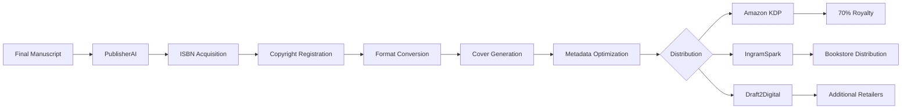
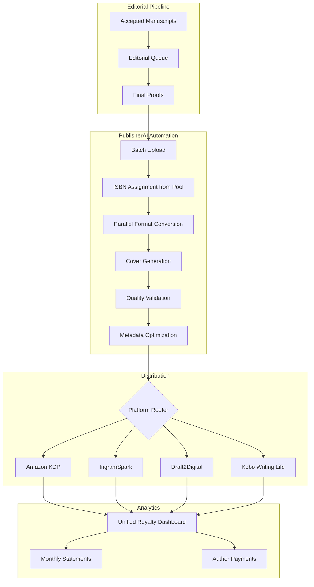
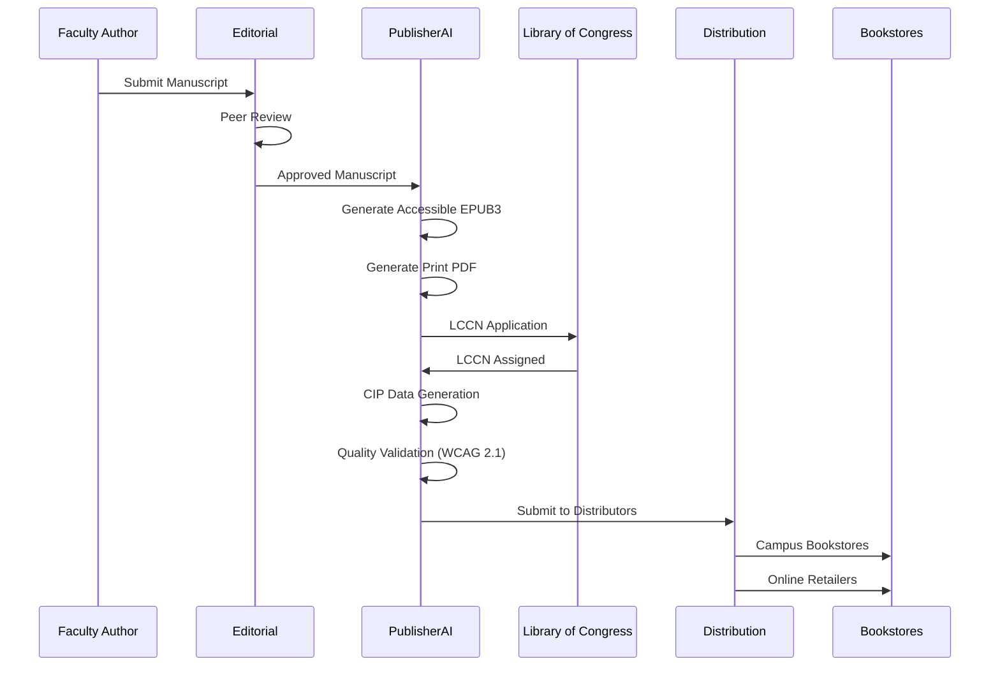
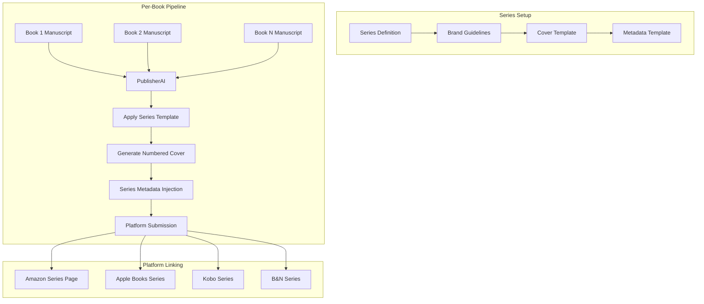
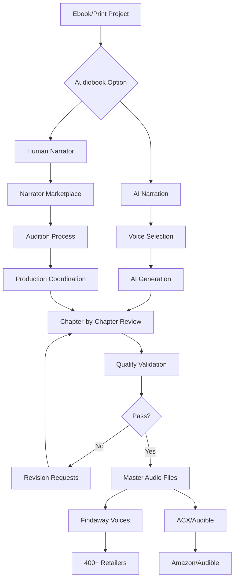

# Industry Use Cases - PublisherAI

Real-world implementations of PublisherAI - Book Publishing and Distribution Platform across different publishing scenarios.

---

## 1. Indie Author Self-Publishing

### Problem

An independent author has completed their debut novel and wants to self-publish across multiple platforms. Traditional publishing routes require literary agents, take 18-24 months, and offer only 10-15% royalties. The author lacks knowledge of ISBN acquisition, copyright registration, format conversion, and platform-specific requirements.

### Solution



### Implementation

```typescript
import { NexusClient } from '@adverant/nexus-sdk';

const client = new NexusClient({ apiKey: process.env.NEXUS_API_KEY });
const publisher = client.plugin('nexus-publisher');

async function publishIndieNovel(manuscriptPath: string) {
  // Create project with full metadata
  const project = await publisher.books.create({
    title: "Shadows of Tomorrow",
    subtitle: "A Thriller Novel",
    author: "Sarah Mitchell",
    description: `In the heart of a city where secrets are currency and trust is a luxury,
    detective Maya Chen discovers a conspiracy that threatens to unravel everything she
    believes about justice. When her partner disappears under mysterious circumstances,
    Maya must navigate a web of corporate corruption, underground networks, and her own
    haunted past to uncover the truth. Shadows of Tomorrow is a gripping thriller that
    explores the boundaries between right and wrong in a world where the line between
    hero and villain blurs with every revelation.`,
    genre: "Fiction",
    subgenres: ["Thriller", "Mystery", "Suspense"],
    bisacCategories: [
      "FICTION / Thrillers / General",
      "FICTION / Mystery & Detective / General",
      "FICTION / Suspense"
    ],
    keywords: [
      "female detective",
      "corporate conspiracy",
      "urban thriller",
      "mystery novel",
      "suspense fiction",
      "crime fiction",
      "page turner"
    ],
    manuscript: fs.createReadStream(manuscriptPath),
    wordCount: 85000
  });

  console.log(`Project created: ${project.projectId}`);

  // Generate AI cover based on genre
  const cover = await publisher.covers.generate({
    projectId: project.projectId,
    title: "Shadows of Tomorrow",
    author: "Sarah Mitchell",
    genre: "Thriller",
    stylePreferences: "dark, mysterious, urban cityscape, dramatic lighting",
    colorPreferences: ["dark blue", "black", "silver"]
  });

  console.log(`Cover generated: ${cover.conceptDescription}`);

  // Run complete publishing pipeline
  const result = await publisher.books.publishFull({
    projectId: project.projectId,
    formats: ['ebook', 'print'],
    printOptions: {
      trimSize: '5.5x8.5',
      paperType: 'cream',
      binding: 'paperback'
    },
    distributionChannels: ['amazon_kdp', 'ingram_spark', 'draft2digital'],
    pricing: {
      ebook_usd: 4.99,
      print_usd: 14.99
    },
    territories: ['worldwide'],
    drmEnabled: false
  });

  console.log(`
    Publishing Complete!
    ISBN: ${result.isbn}
    Copyright: ${result.copyrightRegistrationId}
    LCCN: ${result.lccn}

    Live URLs:
    - Amazon: ${result.liveUrls.amazon_kdp}
    - IngramSpark: ${result.liveUrls.ingram_spark}

    Total Cost: $${result.totalCost}
  `);

  return result;
}
```

### Benefits

| Aspect | Traditional Publishing | PublisherAI |
|--------|----------------------|-------------|
| Time to Market | Months to years | Weeks |
| Royalty Rate | Publisher-set | Self-publishing rates |
| Creative Control | Publisher-dependent | Full author control |
| Distribution | Publisher-managed | Global distribution available |
| Rights | Often contracted away | Author-retained |

---

## 2. Small Press Multi-Title Publishing

### Problem

A small independent press publishes 50+ titles annually across multiple genres. Managing ISBN inventory, coordinating with multiple distributors, tracking royalties across platforms, and maintaining consistent quality standards requires significant administrative overhead. Currently employing 3 full-time staff just for production coordination.

### Solution



### Implementation

```python
from nexus_sdk import NexusClient
from typing import List, Dict
import asyncio

client = NexusClient(api_key=os.environ['NEXUS_API_KEY'])
publisher = client.plugin('nexus-publisher')

class SmallPressPublisher:
    """
    Automated publishing workflow for small press operations.
    """

    def __init__(self):
        self.isbn_pool_threshold = 20  # Reorder when below this
        self.default_channels = ['amazon_kdp', 'ingram_spark', 'draft2digital']

    async def publish_catalog_batch(self, manuscripts: List[Dict]) -> List[Dict]:
        """
        Publish multiple titles in parallel.
        """
        # Ensure adequate ISBN inventory
        await self._check_isbn_inventory(len(manuscripts) * 2)  # ebook + print each

        # Create publishing tasks
        tasks = [
            self._publish_single_title(manuscript)
            for manuscript in manuscripts
        ]

        # Execute in parallel with concurrency limit
        results = await asyncio.gather(*tasks, return_exceptions=True)

        # Generate batch report
        successful = [r for r in results if not isinstance(r, Exception)]
        failed = [r for r in results if isinstance(r, Exception)]

        print(f"Batch complete: {len(successful)} successful, {len(failed)} failed")

        return results

    async def _publish_single_title(self, manuscript: Dict) -> Dict:
        """
        Complete publishing pipeline for a single title.
        """
        # Create project
        project = await publisher.books.create_async(
            title=manuscript['title'],
            author=manuscript['author'],
            description=manuscript['description'],
            genre=manuscript['genre'],
            subgenres=manuscript['subgenres'],
            bisac_categories=manuscript['bisac_categories'],
            manuscript_file=manuscript['file_path'],
            imprint=manuscript.get('imprint', 'Main Press')
        )

        # Assign ISBNs for each format
        isbns = await publisher.isbn.assign_async(
            project_id=project.project_id,
            formats=['ebook', 'print']
        )

        # Generate or use provided cover
        if manuscript.get('cover_file'):
            cover = await publisher.covers.upload_async(
                project_id=project.project_id,
                cover_file=manuscript['cover_file']
            )
        else:
            cover = await publisher.covers.generate_async(
                project_id=project.project_id,
                title=manuscript['title'],
                author=manuscript['author'],
                genre=manuscript['genre']
            )

        # Convert formats
        formats = await publisher.books.convert_async(
            project_id=project.project_id,
            formats=['ebook', 'print'],
            print_options={
                'trim_size': manuscript.get('trim_size', '6x9'),
                'paper_type': manuscript.get('paper_type', 'cream'),
                'binding': manuscript.get('binding', 'paperback')
            }
        )

        # Wait for conversion
        await formats.wait_for_completion()

        # Validate all outputs
        validation = await publisher.quality.validate_async(
            project_id=project.project_id,
            platforms=self.default_channels
        )

        if not validation.all_passed:
            raise ValueError(f"Quality validation failed: {validation.errors}")

        # Submit to distribution channels
        distribution = await publisher.books.distribute_async(
            project_id=project.project_id,
            channels=self.default_channels,
            pricing=manuscript['pricing'],
            territories=manuscript.get('territories', ['worldwide']),
            release_date=manuscript.get('release_date')
        )

        return {
            'project_id': project.project_id,
            'title': manuscript['title'],
            'isbns': isbns,
            'distribution': distribution,
            'status': 'published'
        }

    async def _check_isbn_inventory(self, required: int):
        """
        Ensure adequate ISBN inventory, purchase more if needed.
        """
        inventory = await publisher.isbn.get_inventory_async()

        if inventory.available < required:
            # Purchase ISBN pack
            purchase_qty = 100 if required > 50 else 10
            await publisher.isbn.purchase_async(
                quantity=purchase_qty,
                publisher_name="Independent Press LLC"
            )
            print(f"Purchased {purchase_qty} ISBNs")

    async def generate_royalty_report(self, start_date: str, end_date: str) -> Dict:
        """
        Generate comprehensive royalty report across all platforms and titles.
        """
        report = await publisher.royalties.get_async(
            start_date=start_date,
            end_date=end_date,
            group_by=['platform', 'title', 'author']
        )

        # Calculate author payments
        author_payments = {}
        for entry in report.by_author:
            royalty_rate = entry.royalty_percentage / 100
            author_payments[entry.author] = {
                'gross_revenue': entry.revenue,
                'royalty_due': entry.revenue * royalty_rate,
                'units_sold': entry.units_sold
            }

        return {
            'period': f"{start_date} to {end_date}",
            'total_revenue': report.total_revenue,
            'total_units': report.total_units,
            'platform_breakdown': report.by_platform,
            'title_breakdown': report.by_title,
            'author_payments': author_payments
        }


# Example usage
async def main():
    press = SmallPressPublisher()

    # Batch publish quarterly catalog
    manuscripts = [
        {
            'title': 'The Last Garden',
            'author': 'Emily Rose',
            'description': '...',
            'genre': 'Fiction',
            'subgenres': ['Literary Fiction', 'Contemporary'],
            'bisac_categories': ['FICTION / Literary'],
            'file_path': './manuscripts/last-garden.docx',
            'pricing': {'ebook_usd': 5.99, 'print_usd': 15.99}
        },
        {
            'title': 'Quantum Business',
            'author': 'Dr. Michael Chen',
            'description': '...',
            'genre': 'Non-Fiction',
            'subgenres': ['Business', 'Leadership'],
            'bisac_categories': ['BUSINESS & ECONOMICS / Leadership'],
            'file_path': './manuscripts/quantum-business.docx',
            'pricing': {'ebook_usd': 9.99, 'print_usd': 24.99}
        }
        # ... more manuscripts
    ]

    results = await press.publish_catalog_batch(manuscripts)

    # Generate quarterly royalty report
    report = await press.generate_royalty_report('2024-01-01', '2024-03-31')
    print(f"Q1 Revenue: ${report['total_revenue']:.2f}")

asyncio.run(main())
```

### Benefits

- **Faster time per title** through automated workflows
- **Reduced staffing needs** for publishing operations
- **Automated ISBN management** eliminates manual tracking
- **Streamlined platform submission** to multiple retailers
- **Real-time royalty reconciliation** across platforms

---

## 3. Academic Publisher Course Materials

### Problem

A university press publishes course materials, academic texts, and research monographs. They need to support multiple formats (print for classrooms, ebook for students, accessible formats for disability services), maintain Library of Congress cataloging, and integrate with campus bookstore systems. Compliance with accessibility standards (WCAG 2.1) is mandatory.

### Solution



### Implementation

```typescript
import { NexusClient } from '@adverant/nexus-sdk';

const client = new NexusClient({ apiKey: process.env.NEXUS_API_KEY });
const publisher = client.plugin('nexus-publisher');

interface AcademicPublication {
  title: string;
  author: string;
  contributors?: string[];
  courseSubject: string;
  courseNumber?: string;
  edition?: number;
  targetAudience: 'undergraduate' | 'graduate' | 'professional';
}

async function publishAcademicText(
  manuscriptPath: string,
  publication: AcademicPublication
) {
  // Create academic project with enhanced metadata
  const project = await publisher.books.create({
    title: publication.title,
    author: publication.author,
    coAuthors: publication.contributors,
    description: generateAcademicDescription(publication),
    genre: 'Non-Fiction',
    subgenres: ['Academic', publication.courseSubject],
    bisacCategories: getAcademicBISAC(publication.courseSubject),
    keywords: generateAcademicKeywords(publication),
    manuscript: fs.createReadStream(manuscriptPath),
    publisherType: 'academic'
  });

  // Acquire ISBN for multiple formats
  const isbns = await publisher.isbn.acquire({
    projectId: project.projectId,
    formats: ['ebook', 'print'],
    metadata: {
      edition: publication.edition || 1,
      publisher: 'University Press'
    }
  });

  // Apply for LCCN with CIP data
  const lccn = await publisher.lccn.apply({
    projectId: project.projectId,
    isbn: isbns.print.isbn_13,
    cipData: true,  // Cataloging in Publication
    libraryClassification: getLCClassification(publication.courseSubject)
  });

  console.log(`LCCN assigned: ${lccn.lccn}`);
  console.log(`CIP data: ${lccn.cipBlock}`);

  // Convert with accessibility focus
  const formats = await publisher.books.convert(project.projectId, {
    formats: ['ebook', 'print'],
    ebookOptions: {
      epub3: true,
      accessibility: {
        wcag21: true,
        screenReaderOptimized: true,
        altTextRequired: true,
        structuredNavigation: true,
        mathML: true  // For equations
      }
    },
    printOptions: {
      trimSize: '7x10',  // Academic standard
      paperType: 'white',
      binding: 'paperback',
      includeIndex: true
    }
  });

  await formats.waitForCompletion();

  // Validate accessibility compliance
  const accessibilityReport = await publisher.quality.validateAccessibility({
    projectId: project.projectId,
    standards: ['WCAG21-AA', 'EPUB-ACCESSIBILITY-1.1']
  });

  if (!accessibilityReport.compliant) {
    console.warn('Accessibility issues:', accessibilityReport.issues);
    // Auto-fix where possible
    await publisher.accessibility.autoFix({
      projectId: project.projectId,
      issues: accessibilityReport.fixableIssues
    });
  }

  // Distribute to academic channels
  const distribution = await publisher.books.distribute(project.projectId, {
    channels: ['ingram_spark', 'amazon_kdp'],
    pricing: {
      ebook_usd: calculateAcademicEbookPrice(formats.pageCount),
      print_usd: calculateAcademicPrintPrice(formats.pageCount)
    },
    territories: ['US', 'CA', 'UK'],
    academicPricing: {
      institutionalLicense: true,
      coursePack: true
    },
    metadata: {
      lccn: lccn.lccn,
      cipData: lccn.cipBlock,
      deweyDecimal: lccn.deweyClassification
    }
  });

  // Generate campus bookstore integration data
  const bookstoreData = await publisher.integrations.generateBookstoreData({
    projectId: project.projectId,
    format: 'ONIX',
    includeFields: [
      'isbn', 'title', 'author', 'price', 'availability',
      'courseSubject', 'courseNumber', 'edition'
    ]
  });

  return {
    project,
    isbns,
    lccn,
    accessibilityReport,
    distribution,
    bookstoreData
  };
}

function calculateAcademicPrintPrice(pageCount: number): number {
  // Academic pricing formula
  const baseCost = 5.00;
  const perPageCost = 0.03;
  const markup = 3.5;
  return Math.round((baseCost + (pageCount * perPageCost)) * markup * 100) / 100;
}
```

### Benefits

- **Faster LCCN processing** with pre-validated submissions
- **Automated accessibility compliance** checking (WCAG 2.1)
- **Streamlined format production** across print, ebook, and accessible versions
- **Automated bookstore integration** via ONIX feeds
- **Increased production capacity** through workflow automation

---

## 4. Book Series with Consistent Branding

### Problem

A romance author publishes a 12-book series and needs consistent cover design across all titles, series metadata linking, proper series numbering in retailer systems, and coordinated release schedules for maximum visibility. Managing this across 5+ distribution platforms manually results in inconsistent presentation and missed marketing opportunities.

### Solution



### Implementation

```typescript
import { NexusClient } from '@adverant/nexus-sdk';

const client = new NexusClient({ apiKey: process.env.NEXUS_API_KEY });
const publisher = client.plugin('nexus-publisher');

interface SeriesConfig {
  seriesName: string;
  author: string;
  genre: string;
  totalBooks: number;
  coverStyle: {
    template: string;
    colorScheme: string[];
    typography: string;
  };
  pricing: {
    firstBook: number;      // Often discounted
    regularBook: number;
    boxSet?: number;
  };
}

class SeriesPublisher {
  private seriesConfig: SeriesConfig;
  private seriesId: string;

  constructor(config: SeriesConfig) {
    this.seriesConfig = config;
  }

  async initializeSeries(): Promise<void> {
    // Create series in PublisherAI
    const series = await publisher.series.create({
      name: this.seriesConfig.seriesName,
      author: this.seriesConfig.author,
      genre: this.seriesConfig.genre,
      totalPlannedBooks: this.seriesConfig.totalBooks,
      coverTemplate: {
        style: this.seriesConfig.coverStyle.template,
        colors: this.seriesConfig.coverStyle.colorScheme,
        font: this.seriesConfig.coverStyle.typography,
        seriesBranding: {
          position: 'top',
          format: '"[Series Name] Book [N]"'
        }
      }
    });

    this.seriesId = series.seriesId;
    console.log(`Series created: ${this.seriesId}`);
  }

  async publishSeriesBook(bookNumber: number, manuscript: {
    title: string;
    description: string;
    filePath: string;
    releaseDate?: Date;
  }): Promise<any> {
    // Create book as part of series
    const project = await publisher.books.create({
      title: manuscript.title,
      author: this.seriesConfig.author,
      description: manuscript.description,
      genre: this.seriesConfig.genre,
      subgenres: ['Romance', 'Series'],
      seriesInfo: {
        seriesId: this.seriesId,
        seriesName: this.seriesConfig.seriesName,
        bookNumber: bookNumber,
        totalBooks: this.seriesConfig.totalBooks
      },
      manuscript: fs.createReadStream(manuscript.filePath)
    });

    // Generate cover with series branding
    const cover = await publisher.covers.generateFromTemplate({
      projectId: project.projectId,
      templateId: this.seriesConfig.coverStyle.template,
      title: manuscript.title,
      seriesNumber: bookNumber,
      seriesName: this.seriesConfig.seriesName,
      author: this.seriesConfig.author
    });

    // Convert formats
    await publisher.books.convert(project.projectId, {
      formats: ['ebook'],
      ebookOptions: { epub3: true, mobi: true }
    });

    // Price based on series position
    const price = bookNumber === 1
      ? this.seriesConfig.pricing.firstBook
      : this.seriesConfig.pricing.regularBook;

    // Distribute with series linking
    const distribution = await publisher.books.distribute(project.projectId, {
      channels: ['amazon_kdp', 'apple_books', 'kobo', 'barnes_noble'],
      pricing: { ebook_usd: price },
      territories: ['worldwide'],
      seriesLinking: {
        enabled: true,
        seriesId: this.seriesId,
        previousBook: bookNumber > 1 ? await this.getBookId(bookNumber - 1) : null,
        nextBook: null  // Updated when next book publishes
      },
      releaseDate: manuscript.releaseDate,
      preOrder: manuscript.releaseDate ? {
        enabled: true,
        sampleChapters: 3
      } : undefined
    });

    // Update previous book's "next book" link
    if (bookNumber > 1) {
      await this.linkToPreviousBook(bookNumber, project.projectId);
    }

    return {
      projectId: project.projectId,
      bookNumber,
      distribution
    };
  }

  async createBoxSet(books: number[]): Promise<any> {
    // Generate box set from multiple books
    const boxSet = await publisher.series.createBoxSet({
      seriesId: this.seriesId,
      bookNumbers: books,
      title: `${this.seriesConfig.seriesName}: Books ${books[0]}-${books[books.length - 1]}`,
      pricing: this.seriesConfig.pricing.boxSet
    });

    return boxSet;
  }

  private async getBookId(bookNumber: number): Promise<string> {
    const books = await publisher.series.getBooks(this.seriesId);
    const book = books.find(b => b.bookNumber === bookNumber);
    return book?.projectId;
  }

  private async linkToPreviousBook(currentNumber: number, currentId: string): Promise<void> {
    const previousId = await this.getBookId(currentNumber - 1);
    if (previousId) {
      await publisher.books.updateSeriesLink(previousId, {
        nextBook: currentId
      });
    }
  }
}

// Example usage
async function publishRomanceSeries() {
  const series = new SeriesPublisher({
    seriesName: "Hearts of Willow Creek",
    author: "Jessica Sterling",
    genre: "Romance",
    totalBooks: 12,
    coverStyle: {
      template: "romance-contemporary",
      colorScheme: ["dusty rose", "gold", "cream"],
      typography: "elegant-script"
    },
    pricing: {
      firstBook: 0.99,     // Reader magnet
      regularBook: 4.99,
      boxSet: 9.99
    }
  });

  await series.initializeSeries();

  // Publish first three books
  await series.publishSeriesBook(1, {
    title: "Summer in Willow Creek",
    description: "When city lawyer Emma returns to her hometown...",
    filePath: "./manuscripts/book1.docx",
    releaseDate: new Date('2024-03-01')
  });

  await series.publishSeriesBook(2, {
    title: "Autumn Promises",
    description: "Following her sister's footsteps...",
    filePath: "./manuscripts/book2.docx",
    releaseDate: new Date('2024-04-01')
  });

  await series.publishSeriesBook(3, {
    title: "Winter's Heart",
    description: "The coldest season brings...",
    filePath: "./manuscripts/book3.docx",
    releaseDate: new Date('2024-05-01')
  });

  // Create Books 1-3 box set
  await series.createBoxSet([1, 2, 3]);
}
```

### Results

### Benefits

- **Consistent cover design** across all series titles
- **Automated series linking** on all platforms
- **Streamlined release coordination** for new titles
- **Improved read-through rates** with proper series presentation
- **Revenue growth** through better series discoverability

---

## 5. Audiobook Production and Distribution

### Problem

A successful ebook author wants to expand into audiobooks but faces challenges: narrator selection, production costs ($2,000-5,000 per title), quality control, and navigating ACX/Findaway distribution. Without audiobook versions, they are missing 30-40% of the audiobook market growing at 25% annually.

### Solution



### Implementation

```python
from nexus_sdk import NexusClient
from typing import Optional

client = NexusClient(api_key=os.environ['NEXUS_API_KEY'])
publisher = client.plugin('nexus-publisher')

async def produce_and_distribute_audiobook(
    project_id: str,
    narration_type: str = 'ai',  # 'ai' or 'human'
    voice_preference: Optional[dict] = None
) -> dict:
    """
    Produce and distribute audiobook from existing ebook project.
    """

    # Get existing project details
    project = await publisher.books.get(project_id)

    if narration_type == 'ai':
        # AI narration workflow
        audiobook = await produce_ai_audiobook(project, voice_preference)
    else:
        # Human narrator workflow
        audiobook = await coordinate_human_narration(project)

    # Validate audio quality
    validation = await publisher.audio.validate({
        project_id: project_id,
        audio_files: audiobook.chapter_files,
        standards: {
            'acx': True,       # ACX/Audible requirements
            'findaway': True,  # Findaway specifications
            'bit_depth': 16,
            'sample_rate': 44100,
            'noise_floor': -60,
            'peak_values': {'min': -3, 'max': -0.5}
        }
    })

    if not validation.passed:
        # Auto-correct audio issues where possible
        audiobook = await publisher.audio.enhance({
            project_id: project_id,
            issues: validation.fixable_issues,
            operations: ['noise_reduction', 'normalization', 'compression']
        })

    # Distribute to audiobook platforms
    distribution = await publisher.books.distribute(project_id, {
        'channels': ['findaway_voices'],  # Findaway distributes to 400+ retailers
        'format': 'audiobook',
        'pricing': {
            'audiobook_usd': calculate_audiobook_price(audiobook.duration_hours)
        },
        'territories': ['worldwide'],
        'royalty_share': {
            'type': 'royalty_share' if narration_type == 'human' else 'pay_upfront',
            'narrator_percentage': 50 if narration_type == 'human' else 0
        },
        'exclusive_to_audible': False  # Wide distribution
    })

    return {
        'project_id': project_id,
        'audiobook': audiobook,
        'validation': validation,
        'distribution': distribution,
        'estimated_revenue': estimate_audiobook_revenue(audiobook.duration_hours)
    }


async def produce_ai_audiobook(project: dict, voice_preference: dict) -> dict:
    """
    Generate audiobook using AI narration.
    """

    # Select or customize voice
    if voice_preference:
        voice = await publisher.audio.select_voice({
            'gender': voice_preference.get('gender', 'neutral'),
            'age_range': voice_preference.get('age', 'adult'),
            'accent': voice_preference.get('accent', 'american'),
            'tone': voice_preference.get('tone', 'warm'),
            'genre_optimization': project['genre']
        })
    else:
        # Auto-select best voice for genre
        voice = await publisher.audio.recommend_voice({
            'genre': project['genre'],
            'description': project['description']
        })

    # Generate audio chapter by chapter
    chapter_files = []
    for chapter in project['chapters']:
        audio = await publisher.audio.generate({
            'text': chapter['content'],
            'voice_id': voice['voice_id'],
            'settings': {
                'speed': 1.0,
                'emphasis': True,
                'pause_at_paragraphs': 0.5,
                'pause_at_chapters': 2.0,
                'character_voices': True  # Different voices for dialogue
            }
        })

        # Review opportunity
        print(f"Chapter {chapter['number']} audio generated: {audio['duration_minutes']} min")
        chapter_files.append(audio)

    # Generate opening credits
    opening = await publisher.audio.generate_credits({
        'type': 'opening',
        'title': project['title'],
        'author': project['author'],
        'narrator': voice['name'],
        'copyright_year': datetime.now().year
    })

    # Generate closing credits
    closing = await publisher.audio.generate_credits({
        'type': 'closing',
        'title': project['title'],
        'author': project['author'],
        'cta': 'If you enjoyed this audiobook, please leave a review.'
    })

    total_duration = sum(c['duration_minutes'] for c in chapter_files)

    return {
        'voice': voice,
        'opening_credits': opening,
        'chapter_files': chapter_files,
        'closing_credits': closing,
        'duration_hours': total_duration / 60,
        'production_cost': calculate_ai_narration_cost(total_duration)
    }


def calculate_ai_narration_cost(duration_minutes: float) -> float:
    """AI narration typically costs $0.01-0.05 per minute."""
    return round(duration_minutes * 0.03, 2)


def calculate_audiobook_price(duration_hours: float) -> float:
    """Standard audiobook pricing based on duration."""
    if duration_hours < 3:
        return 9.99
    elif duration_hours < 6:
        return 14.99
    elif duration_hours < 10:
        return 19.99
    else:
        return 24.99


def estimate_audiobook_revenue(duration_hours: float) -> dict:
    """Estimate monthly revenue based on market averages."""
    base_units = 50  # Conservative monthly estimate for backlist
    price = calculate_audiobook_price(duration_hours)
    royalty_rate = 0.40  # Findaway average

    return {
        'estimated_monthly_units': base_units,
        'estimated_monthly_revenue': round(base_units * price * royalty_rate, 2),
        'estimated_annual_revenue': round(base_units * price * royalty_rate * 12, 2)
    }
```

### Results

### Benefits

- **Lower production costs** compared to traditional studio recording
- **Faster turnaround** through AI-powered narration
- **Quality narration** with voice customization options
- **Broader distribution** across multiple audiobook platforms
- **Lower break-even point** enabling more titles to be profitable

---

## Implementation Checklist

When implementing PublisherAI for your publishing workflow:

- [ ] **Define Publishing Goals**: Ebook, print, audiobook, or all formats
- [ ] **Prepare Manuscript**: Final, edited manuscript in supported format
- [ ] **Gather Metadata**: Title, description, categories, keywords
- [ ] **Set Pricing Strategy**: Consider market, genre, and series positioning
- [ ] **Configure Distribution**: Select platforms based on target audience
- [ ] **Set Up Royalty Tracking**: Connect payment accounts for each platform
- [ ] **Plan Release Schedule**: Coordinate across platforms for maximum impact
- [ ] **Monitor Analytics**: Track sales, read-through, and adjust strategy

---

## Next Steps

- **[Architecture Guide](ARCHITECTURE.md)**: Technical implementation details
- **[API Reference](docs/api-reference/endpoints.md)**: Complete endpoint documentation
- **[Quick Start](QUICKSTART.md)**: Get started in 15 minutes
